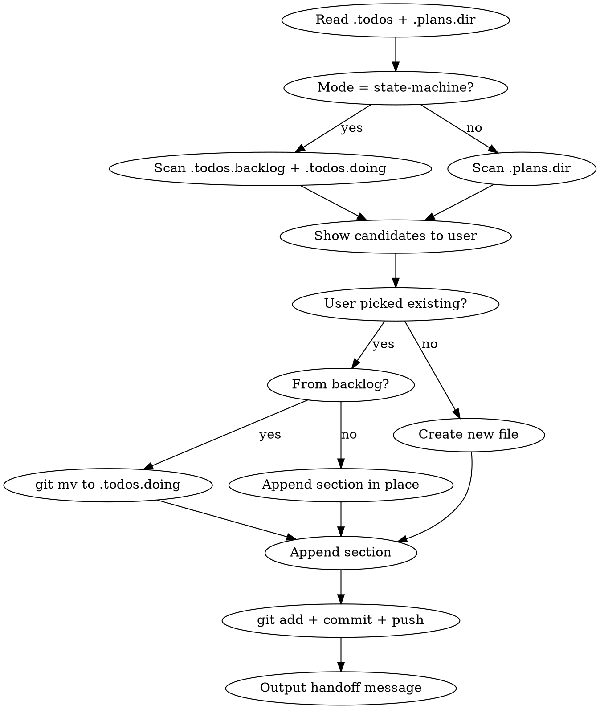

# Worktree Handoff & Plans Redesign

**Status:** Design draft
**Date:** 2026-05-01
**Affected plugins:** `solopreneur`
**Affected skills:** `worktree-handoff`, `merge-pr` (new), `todos-cleanup`, `todos-babysit`, `todos-review`, `greenlight`

## Problem

Three interlocking issues in the current `worktree-handoff` flow:

1. **CONTEXT.md lives in limbo.** `worktree-handoff` writes `docs/CONTEXT.md` into the
   worktree but never commits it. The next session reads it, but it's invisible to
   anyone reviewing the PR, never lands on `main`, and gets `git rm`'d at merge time —
   so the original "why" of the work is lost the moment the PR merges.

2. **Complicates `greenlight` clean-tree precondition.** `greenlight` PR mode
   (`plugins/solopreneur/skills/greenlight/SKILL.md:120`) checks `git status
   --porcelain` and asks the user whether to commit first — not a hard refusal,
   but a friction point. More importantly, the fix subagents in Phase 2/3
   auto-commit + push anything in the working tree, so an uncommitted
   `CONTEXT.md` risks getting swept into a review-fix commit and pushed by
   accident.

3. **Duplicates user-managed plans.** Users who already track planning docs in
   `todos/backlog/` (or anywhere else) end up with two sources of truth: the planning
   doc that drove the work, and a brand-new `CONTEXT.md` that restates it. The
   handoff doc rots; the plan doc rots; merge time reconciles neither.

A secondary issue surfaced during design: `~/.claude/solopreneur.json` is
hardcoded across 15 sites in 4 skills (14 operational read/write + 1 doc-comment
schema example in `todos-babysit/SKILL.md:52`). Users with multiple Claude Code
configs (`CLAUDE_CONFIG_DIR=...`) have no way to override per-config — which is
the entire point of multi-config setup.

## Goals

- Handoff context lives in a single file that is **committed to the branch**, so it
  travels with the PR, survives merge as historical record, and doesn't fight
  `greenlight`.
- Reuse the user's existing planning doc (`todos/doing/<task>.md` or wherever) when
  one exists; only create a new file when no plan exists.
- Make the planning-doc location **configurable per Claude Code config**, with a
  sensible default (`docs/solopreneur/plans/`) for users who don't customize.
- Bring `merge-pr` into the plugin so the lifecycle (`plan → handoff → merge`) is
  governed by one consistent set of paths.

## Non-Goals

- Changing how `greenlight` works internally. Its clean-tree precondition stays.
- Rewriting `todos-cleanup` / `todos-babysit` / `todos-review` semantics. Only the
  config-read path changes.
- Auto-detecting plan files by content similarity. Slug match + interactive picker
  is enough.
- Building any sort of plan template. Existing `## ...` structure from CONTEXT.md
  is fine.

## Solution Overview

Three coordinated changes shipped in a single PR:

1. **Cascade config helper** — read from `$CLAUDE_CONFIG_DIR/solopreneur.json` with
   fallback to `~/.claude/solopreneur.json`. Writes go to the primary (per-config)
   location, creating overrides on first save.
2. **Redesigned `worktree-handoff`** — discovers existing plan files, appends a
   dated `## Handoff Context` section, commits everything before exit. Only
   creates a new file when no plan matches.
3. **`merge-pr` migrated into the plugin** — extends Step 3 with a plan-file
   consolidation pass before moving to `done/`.

## Detailed Design

### 1. Config schema

`solopreneur.json` gains a new top-level `plans` key. Existing keys unchanged:

```json
{
  "todos": {
    "backlog": "todos/backlog",
    "doing":   "todos/doing",
    "done":    "todos/done",
    "later":   "todos/later"
  },
  "plans": {
    "dir": "docs/solopreneur/plans"
  },
  "greenlight": { /* unchanged */ },
  "discord":    { /* unchanged */ }
}
```

**Two operating modes**, derived from which keys are present:

| Mode | Trigger | Plan files live in | Lifecycle |
|------|---------|---------------------|-----------|
| **State-machine** | `.todos` configured | `<doing>/<file>.md` while active, moves to `<done>/` on merge | `backlog → doing → done` |
| **Flat** | `.todos` absent (or no match), `.plans.dir` available | `<plans.dir>/<file>.md`, stays put after merge | single dir, no movement |

When both `.todos` and `.plans.dir` are configured, state-machine wins for
discovery and creation. Flat mode is the fallback.

### 2. Cascade config helper

A new shared reference document at
`plugins/solopreneur/skills/_shared/config.md` defines the cascade convention.
All skills source the convention by including the same shell snippet (skills
are markdown documents — there's no shared lib mechanism, so the snippet is
the convention).

**Read** (primary first, fallback if primary missing or key absent):

```bash
# Reads a top-level key from solopreneur.json with cascade.
# Usage: read_solopreneur_config <key>   # e.g. read_solopreneur_config todos
read_solopreneur_config() {
  local key="$1"
  local primary="${CLAUDE_CONFIG_DIR:-$HOME/.claude}/solopreneur.json"
  local fallback="$HOME/.claude/solopreneur.json"

  # Primary exists AND has the key set → use primary
  if [ -f "$primary" ] && jq -e "has(\"$key\")" "$primary" >/dev/null 2>&1; then
    jq -r ".${key} // empty" "$primary"
    return
  fi
  # Otherwise fall back to ~/.claude
  if [ "$primary" != "$fallback" ] && [ -f "$fallback" ]; then
    jq -r ".${key} // empty" "$fallback"
  fi
}
```

Key semantics:

- **Per-key cascade** — `has("todos")` not file existence. A primary file with
  only `.greenlight` set still falls back to `~/.claude` for `.todos`. This
  matches user mental model: "set what you want to override; inherit the rest."
- **No merge of primary + fallback objects.** Whichever wins for that key
  returns its full subtree as-is. Deep merging is out of scope (would invite
  surprises around array-vs-object overrides).

**Write** (always to primary, atomic, with re-read before merge):

```bash
# Writes a top-level key to the primary solopreneur.json.
# Usage: write_solopreneur_config <key> <jq_expression_producing_value>
# Example: write_solopreneur_config todos '{backlog:"todos/backlog",doing:"todos/doing"}'
write_solopreneur_config() {
  local key="$1"
  local value_expr="$2"
  local primary="${CLAUDE_CONFIG_DIR:-$HOME/.claude}/solopreneur.json"
  local tmp

  mkdir -p "$(dirname "$primary")"
  tmp=$(mktemp "${primary}.XXXXXX")

  # Re-read primary at write time (defends against races between concurrent
  # sessions writing different keys). Then build the new JSON via jq -n which
  # accepts arbitrary value expressions, including object literals.
  local existing
  existing=$(cat "$primary" 2>/dev/null || echo '{}')
  echo "$existing" \
    | jq --argjson v "$(jq -n "$value_expr")" ".${key} = \$v" \
    > "$tmp"

  # Atomic publish: rename is atomic on POSIX filesystems, so concurrent readers
  # never see a half-written file.
  mv "$tmp" "$primary"
}
```

Key points:

- **`jq -n "$value_expr"`** evaluates an arbitrary jq expression with no input
  — works for object literals (`{a:1,b:2}`), strings, arrays, etc. The
  earlier draft used `echo "" | jq "$value_expr"` which produced an empty
  string for object literals and made `--argjson` fail.
- **Re-read before merge** so two sessions writing different keys don't
  clobber each other (last write still wins for the same key — that's
  unavoidable without locking, but cross-key writes are now safe).
- **Atomic publish via `mv`** — concurrent readers never see a half-written
  file.

When primary doesn't exist yet, this creates it. Existing
`~/.claude/solopreneur.json` is **never** modified by writes — it remains the
shared baseline.

#### `CLAUDE_CONFIG_DIR` propagation

The helpers run inside skill bash blocks. Skills are LLM-interpreted markdown
executed via the main session's `Bash` tool, which inherits the parent
environment — including `CLAUDE_CONFIG_DIR`. Verified working in
`rebuild-skill-index/SKILL.md:30` (`BASE="${CLAUDE_CONFIG_DIR:-$HOME/.claude}"`).

Subagents dispatched via the `Agent` tool also run their bash via the same
mechanism, so they inherit the same env. The fallback `:-$HOME/.claude` keeps
the helpers safe even if a future runtime strips the var.

### 3. `worktree-handoff` redesign



#### Step-by-step

1. **Resolve mode and paths.** Read `.todos` and `.plans.dir` via cascade
   helper. State-machine if `.todos.backlog` and `.todos.doing` both present;
   else flat with `.plans.dir` (default `docs/solopreneur/plans`).

2. **Create the worktree.** Unchanged from current flow (`git worktree add
   .worktrees/<slug> -b <branch>`).

3. **Copy gitignored env config.** Unchanged (`.env`, `*.xcconfig`, etc.).

4. **Discover candidate plan files.** List existing `*.md` in:
   - State-machine: `<backlog>/` and `<doing>/`
   - Flat: `<plans.dir>/`

   Show the candidates to the user with index numbers and ask:

   > "Which plan does this worktree belong to? Pick a number, or 'new' to
   > create a fresh plan file."

   This is choice **(a)** from S1 — interactive picker, no auto-detection.
   Auto-matching by branch slug was rejected because branches are often named
   after symptoms ("fix-sleep-calc") while plans are named after intent
   ("healthkit-dedup-strategy") — false matches would silently corrupt the
   wrong plan.

5. **If user picked an existing plan in `<backlog>/`:** `git mv` it to
   `<doing>/` (state-machine mode only). In flat mode this step is skipped.

6. **Append handoff section.** Open the chosen file (or create a new one with
   filename `<YYYY-MM-DD>-<branch-slug>.md` per S2). For new files, write a
   top-of-file marker block; for existing files, ensure a `Plan-Branch` line
   is present in the marker block (append the branch if absent). Then append:

   ```markdown
   <!--
   Plan-Branch: fix/sleep-calc
   Plan-Branch: feature/another-branch-that-reused-this-plan
   -->

   ## Handoff Context (2026-05-01, branch: fix/sleep-calc)

   ### Problem Background
   <why is this being done — user reports, screenshots, logs>

   ### Root Cause
   <known technical issues, with file paths + line numbers>

   ### Items to Fix / Implement
   - [ ] <item with expected approach>

   ### Key Files
   | path | description |

   ### Current Progress
   <not started / steps done so far>
   ```

   The HTML-comment block at the top is **machine-readable**: each
   `Plan-Branch: <branch>` line records a branch that uses (or used) this
   plan. The block is invisible in rendered markdown but trivially greppable
   by `merge-pr`. One plan can list multiple branches (when the same plan
   spans several PRs).

   The `## Handoff Context (<date>, branch: <branch>)` heading is a
   secondary marker for matching specific handoff sections within a
   multi-branch plan — date for ordering, branch name for scoping. Date
   format `YYYY-MM-DD`.

7. **Commit and push.** Single commit:
   `docs(handoff): context for <branch-name>`. Push so the doc is visible to
   the next session and to PR reviewers.

8. **Output the handoff message.** Same shape as today, with the plan file
   path stated explicitly so the next session doesn't have to discover it:

   ```
   cd /path/to/repo/.worktrees/<slug>

   Plan file: <relative/path/to/plan.md>
   Read the plan file for the full context — branch <branch> is tracked under
   the `Plan-Branch:` marker, and the latest `## Handoff Context` section
   captures the current state.
   Branch: <branch>, <one-line task description>.
   ```

#### File-naming convention (S2)

New plan files created by `worktree-handoff` use:

```
<YYYY-MM-DD>-<branch-slug>.md
```

Example: `2026-05-01-fix-sleep-calculation.md`. The date prefix:

- Sorts naturally by creation order in the directory listing
- Matches the existing convention in the user's `todos/done/` (per
  observation in current `merge-pr` Step 3 line 104)
- Gets reused as the basis for the merge-time rename if needed

When the user picks an **existing** plan file, the filename is left alone —
appending happens in place. No renaming.

### 4. `merge-pr` migration into plugin

Move `~/Agents/skills/hana/merge-pr/SKILL.md` to
`plugins/solopreneur/skills/merge-pr/SKILL.md`.

#### What's kept from the personal-skill version

- **Step 0 (worktree-safety scan + cleanup of merged-but-not-removed
  worktrees, while never deleting the current session's own worktree)** —
  this is general-purpose plugin logic and stays as-is.
- **Step 4 (`gh pr merge --squash --delete-branch`)** — unchanged.
- **Step 5 (status report)** — unchanged.

#### What's dropped from the personal-skill version

- **Step 6 (optional backlog batch cleanup via subagent)** — overlaps the
  `todos-cleanup` skill, which already exists in the plugin and does this
  job more thoroughly. Users who want batch cleanup run `/todos-cleanup`.
- **"Repo 路徑（多 repo 專案用）" section** — hardcodes a personal project
  layout (`backend/`, `apple/`, `android/`, `web/`, `browser-ext/`) that
  doesn't generalize. The plugin should not ship with personal directory
  conventions baked in. (Per user decision: not migrated to personal
  CLAUDE.md either — just dropped.)

#### Changes from the current personal-skill version

**Step 2 (Worktree pre-merge cleanup).** The current version does:

```bash
git rm docs/CONTEXT.md 2>/dev/null
git rm -r docs/superpowers/ 2>/dev/null
```

The new flow commits its plan file intentionally — it should land on
`main`, not get rm'd. **But for one release** both legacy `git rm` lines
stay (with `|| true`) to clean up worktrees that pre-date the redesign.
After that release, both lines are dropped (tracked in Open Questions
below).

After the legacy cleanup, add the clean-tree refusal:

```bash
# Legacy cleanup (kept for one release; remove next minor bump)
git rm docs/CONTEXT.md 2>/dev/null || true
git rm -r docs/superpowers/ 2>/dev/null || true
git diff --cached --quiet || {
  git commit -m "chore: remove legacy worktree-specific files before merge"
  git push
}

# Refusal (new): the new flow commits everything intentionally, so anything
# uncommitted at this point is unintentional and must be surfaced.
if [ "$IS_WORKTREE" = "yes" ] && ! git diff --quiet HEAD; then
  echo "Worktree has uncommitted changes after legacy cleanup — refusing to merge."
  echo "Commit or stash first, then re-run /merge-pr."
  exit 1
fi
```

**Step 3 (Move todo) extended with consolidation pass.**

##### 3a. Resolve plan file path

Define **plan roots** = union of `.todos.backlog`, `.todos.doing`, and
`.plans.dir` (whichever are configured + their defaults). The plan file for
this branch lives in one of these roots.

Resolution order (first hit wins):

1. **Plan-Branch marker (primary).** `grep -lE '^Plan-Branch: <branch>$'`
   across all `*.md` in plan roots. Match exact branch name, anchored. This
   is robust against squash-merge, amend, rebase, and rename — the marker
   lives in the file, not in commit history.

2. **Commit-history grep (fallback).** If no marker match (e.g. user manually
   edited the file and lost the marker), search `git log
   --pretty=format:'%H %s' main..HEAD --name-only` for the most recent commit
   matching `docs(handoff): context for <branch>` and pick the `.md` file it
   touched, restricted to plan roots.

3. **No match → skip consolidation entirely.** Not every branch has a plan
   file. Step 3 then proceeds to the regular todo move (existing behavior
   for branches without plans — unchanged).

##### 3b. Rule-based consolidation

For the resolved plan file:

- Find all `## Handoff Context (<date>, branch: <this-branch>)` sections —
  match by branch name in the heading, not just date, so reused plans stay
  scoped.
- Rename the latest matching one to
  `## Final Progress (merged <YYYY-MM-DD>, branch: <this-branch>)` and keep
  its content verbatim as the final state record. **Do not modify checkboxes
  inside the section** — aspirational or skipped items must not be silently
  marked done. Reviewer reads the section and sees what shipped vs. what
  didn't, exactly as the last handoff described.
- Delete **older same-branch** `## Handoff Context` sections (the latest
  supersedes them).
- Sections from **other branches** (different `branch:` value in heading) are
  left untouched — multi-branch plans stay scoped.
- Top-of-file status line (if present, e.g. `Status: doing`) updated to
  `Status: merged <YYYY-MM-DD>`.

##### 3c. Commit consolidation

`docs: consolidate plan progress before merging PR #<N>`.

##### 3d. Move file (state-machine mode only)

`git mv <doing>/<file> <done>/<file>`. Filename: same date prefix preserved
— don't re-date to merge date, the file's git history captures both
creation and merge dates.

Flat mode: file stays in `.plans.dir`. No movement.

##### 3e. Commit move (state-machine only)

`chore: move <file> to done/`.

#### Rationale for rule-based over subagent (S3)

Rule-based consolidation is:

- **Predictable** — same input always produces the same output. A subagent
  could rephrase or reorganize text in ways that lose information.
- **Reviewable** — the user can read a deterministic spec to know what got
  changed; no need to inspect a subagent's reasoning trail.
- **Cheap** — pure shell + maybe a small awk/sed script. No agent dispatch.

The trade-off is the consolidation doesn't synthesize a "what was actually
shipped" summary. That's left to the PR description and commit messages,
which are already reviewed by humans at merge time.

### 5. Sweep existing skills for cascade config path

15 hardcoded references to `~/.claude/solopreneur.json` total: 14
operational read/write sites + 1 doc-comment schema example.

| Skill | Sites | Action |
|-------|-------|--------|
| `todos-cleanup` | 3 | Replace read at line 22, write at lines 43–49 |
| `todos-babysit` | 4 operational + 1 doc-example | Replace reads at lines 25–26, 40, 268–269; update the JSON schema example at line 52 to reference `${CLAUDE_CONFIG_DIR:-~/.claude}` so docs match the cascade |
| `todos-review` | 1 | Replace read at line 21 |
| `greenlight` | 5 | Replace read at line 130, write at lines 718–725; update doc references at 700, 718 |

Each operational replacement is mechanical: swap the inline `jq -r '.<key>
// empty' ~/.claude/solopreneur.json` with `read_solopreneur_config <key>`
(and the helper-function preamble at the top of each skill that uses it).
Same for writes. The doc-comment schema example in `todos-babysit/SKILL.md:52`
gets a path update only — no functional change there.

The shared helper definition lives in `_shared/config.md` as the single
canonical source. SKILL.md files are LLM-interpreted markdown, not executed
shell scripts — so each skill that touches config inlines the helper
functions near the top of its bash blocks (verbatim copy from
`_shared/config.md`).

This duplication is acceptable because:

- Skills are read by LLMs, not sourced as shell scripts. There's no runtime
  `import` mechanism to deduplicate against.
- The helpers are ~15 lines each, low maintenance burden.
- Centralizing in `_shared/` lets reviewers verify all copies match — and
  gives `release` / future tooling a single place to grep when the helper
  needs to change.

When the helper changes, all skills get re-synced from `_shared/config.md`
manually (or via a future sync script — out of scope here).

### 6. Backwards compatibility & migration

- **Existing `~/.claude/solopreneur.json` keeps working unchanged.** The
  cascade falls through to it when primary is missing or doesn't have the
  key. Users who never set `CLAUDE_CONFIG_DIR` see no behavior change.
- **Existing worktrees with un-committed `docs/CONTEXT.md` or
  `docs/superpowers/`** continue to merge cleanly — `merge-pr` Step 2 keeps
  both legacy `git rm` lines (with `|| true`) for one release. Both lines
  are dropped in the next minor bump (tracked in Open Questions).
- **First-time `worktree-handoff` after upgrade** with no `.plans.dir`
  set: defaults to `docs/solopreneur/plans/`, creates the directory on
  first use. No prompt unless the user wants to customize.
- **Users without `.todos` configured** automatically land in flat mode.
  No state-machine surprises.
- **Plan files predating this redesign** (no `Plan-Branch:` marker)
  fall through to the commit-history grep fallback in `merge-pr` Step 3a.
  If both fail, consolidation is skipped — the merge still succeeds, the
  user just doesn't get the rename/dedupe pass that round.

### 7. Testing strategy

Manual test scenarios (no automated test infra exists in this repo):

1. **State-machine + existing plan in backlog.** User has `.todos` set and a
   `todos/backlog/healthkit-dedup.md`. Run `worktree-handoff`, pick the file.
   Verify: file moves to `todos/doing/`, `## Handoff Context` appended,
   single commit, working tree clean post-handoff.

2. **State-machine + no existing plan.** User has `.todos` set but no
   matching file. Pick "new". Verify: new file created in `todos/doing/`
   with date-prefixed name, content has the five-section template, single
   commit.

3. **Flat mode + no plan dir yet.** User has only `.plans.dir` (or nothing,
   defaults to `docs/solopreneur/plans/`). Run handoff. Verify: directory
   created, file written there, committed.

4. **Cascade override.** User has `~/.claude/solopreneur.json` with
   `.todos`, sets `CLAUDE_CONFIG_DIR` and creates a primary
   `solopreneur.json` with only `.greenlight` overridden. Verify: `.todos`
   reads from `~/.claude` (fallback), `.greenlight` reads from primary.

5. **`greenlight` PR mode after handoff.** Run handoff (which commits
   plan), then `greenlight`. Verify: pre-flight clean-tree check passes
   without prompting.

6. **`merge-pr` consolidation, single branch.** Plan file with two
   `## Handoff Context` sections (separate dates, same branch) and unchecked
   items. Run `merge-pr`. Verify: only the latest matching section remains,
   renamed to `## Final Progress (merged ...)`, **checkboxes preserved
   verbatim** (not flipped), older same-branch section deleted, file moved
   to `todos/done/`.

7. **`merge-pr` consolidation, multi-branch plan.** Plan with `Plan-Branch:`
   listing two branches and one `## Handoff Context` section per branch.
   Merge from the first branch. Verify: only the first branch's section is
   renamed to `## Final Progress`; the second branch's `## Handoff Context`
   section is untouched.

8. **`merge-pr` flat mode.** Plan in `docs/solopreneur/plans/`, no
   `.todos` config. Run merge. Verify: consolidation runs, file stays in
   `docs/solopreneur/plans/`, no movement.

9. **`merge-pr` legacy worktree compatibility.** Worktree predating the
   redesign with uncommitted `docs/CONTEXT.md`. Run merge. Verify: legacy
   `git rm` removes the file, clean-tree refusal does not fire, merge
   proceeds.

10. **`merge-pr` plan-file resolution fallback.** Plan file present in
    `.plans.dir` but no `Plan-Branch:` marker (manually edited by user).
    Run merge. Verify: commit-history grep finds the file via
    `docs(handoff): context for <branch>` commit, consolidation runs.

## Decisions Log

| ID | Question | Decision | Rationale |
|----|----------|----------|-----------|
| S1 | How does `worktree-handoff` find the matching plan file? | Interactive picker over candidate list | Branch names ≠ plan names; auto-match would silently corrupt wrong plans |
| S2 | New plan file naming convention | `<YYYY-MM-DD>-<branch-slug>.md` | Matches existing `todos/done/` convention; sorts naturally |
| S3 | Merge-time consolidation: rule-based or subagent? | Rule-based + rename `## Handoff Context` → `## Final Progress (merged <date>)` | Predictable, reviewable, cheap; no info loss risk |
| S7 | Auto-flip `[ ]` → `[x]` at consolidation? | **No** | Aspirational/skipped items would be falsely marked done. Reviewer reads the section and infers shipped vs. not-shipped from commit history |
| S8 | Concurrent-write safety for cascade write helper | Re-read primary at write time + atomic `mv` via tempfile | Different keys can be written from concurrent sessions without clobbering |
| S10 | Migrating personal `merge-pr` quirks | Keep Step 0 / Step 4-5; drop Step 6 + Repo paths section | Step 6 overlaps `todos-cleanup`; Repo paths hardcode personal layout |
| Config | One JSON or per-config | Cascade: `$CLAUDE_CONFIG_DIR/` then `~/.claude/` | Zero-migration for existing users; opt-in per-config override |
| Branch→plan mapping | How does `merge-pr` reliably find a branch's plan? | `Plan-Branch:` HTML-comment marker in the plan file (primary) + commit-history grep (fallback) | Marker is robust against squash-merge / amend / rebase / rename; commit grep handles legacy plans without markers |
| Scope | Single PR or split | Single PR | Config helper sweep is mechanical; bundling avoids two-step migration |

## Open Questions / Follow-ups

- **`docs/spec/` vs `docs/superpowers/specs/`** — this spec is at
  `docs/spec/` per the user's CLAUDE.md note about "this repo's docs/spec".
  If `superpowers:writing-plans` later writes a different path, we'll
  reconcile then.
- **Should `merge-pr` also offer to clean up the worktree directory after
  merge?** Currently it relies on the next session's Step 0 to clean stale
  worktrees. Out of scope for this PR.
- **Legacy cleanup removal** — after this PR ships, schedule a follow-up
  one minor bump later to drop both the `git rm docs/CONTEXT.md` and
  `git rm -r docs/superpowers/` lines from `merge-pr` Step 2. Tracked here
  so it doesn't get forgotten.
- **`_shared/config.md` sync mechanism** — currently the helper functions
  are inlined verbatim into each consuming skill. If the helper grows or
  the inline copies drift, build a small sync script (out of scope for
  this PR).

## Implementation order

Suggested commit sequence inside the PR:

1. Add `plugins/solopreneur/skills/_shared/config.md` (cascade helper spec).
2. Sweep existing 14 hardcoded `~/.claude/solopreneur.json` references to
   inline the cascade helper.
3. Rewrite `worktree-handoff/SKILL.md` (state-machine + flat modes,
   interactive picker, append-or-create flow).
4. Move `merge-pr` from `~/Agents/skills/hana/` into
   `plugins/solopreneur/skills/merge-pr/` and extend Step 3 with the
   consolidation pass.
5. Update `.claude-plugin/marketplace.json` if `merge-pr` needs an entry
   (verify how other skills are listed first — they may be auto-discovered
   from `skills/`).
6. Update top-level `CLAUDE.md` if any user-facing convention changed
   (probably not — config schema is internal).
7. Bump `plugins/solopreneur/.claude-plugin/plugin.json` patch version on
   release via `/release` skill (don't touch the version manually).
